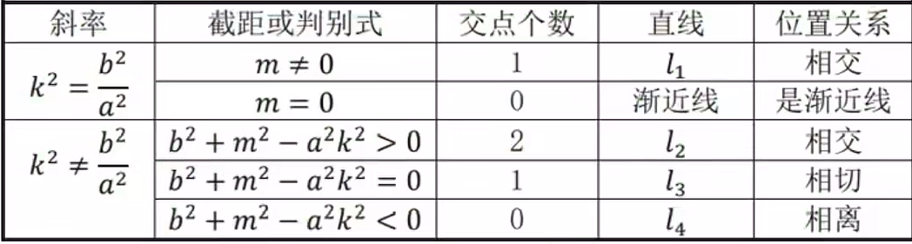

**性质1: 直线与双曲线位置关系(5种)**  
设直线方程为 $y=kx+m$ ，双曲线方程为 $\dfrac{x^2}{a^2}-\dfrac{y^2}{b^2}=1$  
  
联立之后得 $(b^2-a^2k^2)x^2-2kma^2x-a^2m^2-a^2b^2=0\cdots\cdots(1)$  
  
开始进行分类讨论  
  
Case1: $b^2-a^2k^2=0$  
  
$\Rightarrow b^2=a^2k^2$  
  
$\Rightarrow k=\pm\sqrt{\dfrac{b}{a}}$  
  
此时方程 $(1)$ 变为 $2kma^2x+a^2m^2+a^2b^2=0$  
  
若 $m\neq0$ ，则存在一个交点，从图像上看，此时直线是与渐近线平行，但不过原点的直线  
  
若 $m=0$ ，则直线与双曲线无交点，从图像上看，此时直线就是渐近线  
  
Case2: $b^2-a^2k^2\neq0$  
  
计算判别式并化简得 $\Delta=4a^2b^2(m^2+b^2-a^2k^2)$  
  
$\Delta=4a^2b^2(m^2+b^2-a^2k^2)>0\Leftrightarrow$ 直线与双曲线有两个交点  
  
$\Delta=4a^2b^2(m^2+b^2-a^2k^2)=0\Leftrightarrow$ 直线与双曲线有一个交点  
  
$\Delta=4a^2b^2(m^2+b^2-a^2k^2)\geq0\Leftrightarrow$ 直线与双曲线至少存在一个公共交点  
  
$\Delta=4a^2b^2(m^2+b^2-a^2k^2)<0\Leftrightarrow$ 直线与双曲线无交点  
  
  
$\Rightarrow$ 与双曲线相交只有一个交点的直线有两种: 1 平行于渐近线，但不过原点的直线，2 其中一支的切线  
  
$\Rightarrow$ 与双曲线无交点的直线也存在两种  
1 渐近线  
2 $\alpha\in[\theta,\pi-\theta]$ ， $\alpha$ 是直线与 $x$ 轴正向的夹角， $\theta=\arctan\dfrac{b}{a}$ ，但不相切  
  
综上: 无交点(2种)，只有一个交点(2种)，两个交点(1种)  
  
3大类，5小类  

注: 椭圆是3种

**直线与双曲线位置关系截图**  
  
