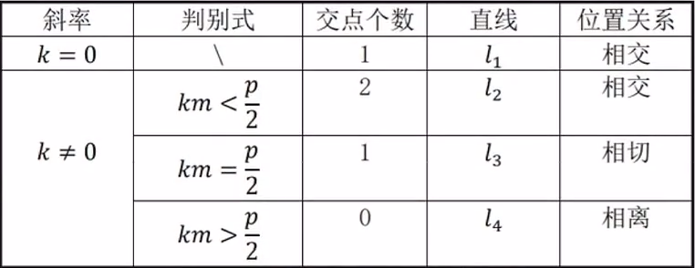

**内容**  
抛物线与直线的位置关系有4种  
  
**证明**  
设抛物线方程为 $y^2=2px$ ，直线方程为 $y=kx+m$  
  
联立之后得 $k^2x^2+(2km-2p)x+m^2=0\cdots\cdots(1)$  
  
开始进行分类讨论  
  
Case1: $k^2=0$  
  
此时方程 $(1)$ 变为 $-2px=m^2$  
  
$\Rightarrow$ 直线与抛物线存在一个交点(相交)，交点坐标为 $\left(-\dfrac{m^2}{2p},\  -\dfrac{km^2}{2p}+m\right)$ ，  
  
此时直线是一条平行于 $x$ 轴的直线  
  
Case2: $k^2\neq0$  
  
计算判别式并化简得 $\Delta=4p(p-2km)$  
  
$\Delta=4p(p-2km)>0\Leftrightarrow$ 直线与抛物线有两个交点  
  
$\Delta=4p(p-2km)=0\Leftrightarrow$ 直线与抛物线有一个交点 (相切)  
  
$\Delta=4p(p-2km)\geq0\Leftrightarrow$ 直线与抛物线至少存在一个公共交点  
  
$\Delta=4p(p-2km)<0\Leftrightarrow$ 直线与抛物线无交点  
  
综上: 无交点(1种)，只有一个交点(2种)，两个交点(1种)  
  
3大类，4小类  
  
**直线与抛物线位置关系截图**  
  
